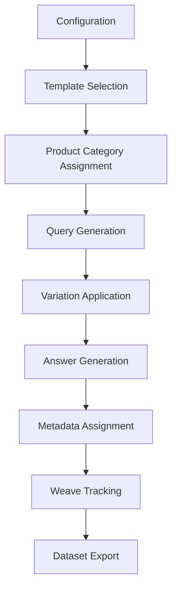

# Synthetic Test Data for RAG Evaluation

This document provides comprehensive guidance on creating and using synthetic test data for evaluating the RAG (Retrieval-Augmented Generation) system, with full Weave integration for tracking and analysis.

## Table of Contents

- [Overview](#overview)
- [Architecture](#architecture)
- [Quick Start](#quick-start)
- [Configuration](#configuration)
- [Generation Techniques](#generation-techniques)
- [Weave Integration](#weave-integration)
- [Best Practices](#best-practices)
- [Examples](#examples)
- [Quality Analysis](#quality-analysis)
- [Troubleshooting](#troubleshooting)

## Overview

Synthetic test data generation addresses key challenges in RAG system evaluation:

- **Scale**: Generate hundreds of test cases automatically
- **Coverage**: Systematic testing across all query types and difficulty levels
- **Consistency**: Reproducible evaluation datasets with configurable parameters
- **Cost**: Reduce dependency on manual test case creation
- **Edge Cases**: Include challenging scenarios that might be missed manually

The synthetic data system integrates seamlessly with the existing evaluation framework and provides full Weave traceability.

## Architecture

### Core Components

```
src/evaluation/
├── synthetic_data_generator.py  # Main generation engine
├── dataset.py                   # Data structures and utilities
└── evaluator.py                 # Evaluation framework

run_synthetic_evaluation.py      # Command-line interface
examples/synthetic_data_examples.py  # Usage demonstrations
```

### Data Flow



## Quick Start

### 1. Basic Synthetic Generation

```bash
# Generate 30 synthetic examples with default settings
uv run python run_synthetic_evaluation.py --synthetic-only --num-synthetic 30
```

### 2. Mixed Dataset (Original + Synthetic)

```bash
# Create mixed dataset with 50% synthetic data
uv run python run_synthetic_evaluation.py --mixed-dataset --save-datasets
```

### 3. Custom Configuration

```bash
# Custom difficulty distribution (20% easy, 30% medium, 50% hard)
uv run python run_synthetic_evaluation.py \
  --difficulty-easy 0.2 \
  --difficulty-medium 0.3 \
  --difficulty-hard 0.5 \
  --project-name "challenging-rag-eval"
```

### 4. Interactive Examples

```bash
# Run comprehensive examples showing all features
uv run python examples/synthetic_data_examples.py
```

## Configuration

### SyntheticDataConfig

The `SyntheticDataConfig` class controls all aspects of synthetic data generation:

```python
from evaluation.synthetic_data_generator import SyntheticDataConfig

config = SyntheticDataConfig(
    num_examples_per_category=5,
    difficulty_distribution={"easy": 0.3, "medium": 0.5, "hard": 0.2},
    query_type_weights={
        "product_info": 0.25,
        "product_reviews": 0.20,
        "product_comparison": 0.15,
        "product_complaints": 0.15,
        "product_recommendation": 0.15,
        "use_case": 0.10
    },
    variation_techniques=["rephrase", "specificity", "context", "perspective"]
)
```

### Configuration Parameters

| Parameter | Description | Default |
|-----------|-------------|---------|
| `num_examples_per_category` | Examples per product category | 5 |
| `difficulty_distribution` | Proportion of easy/medium/hard | 30%/50%/20% |
| `query_type_weights` | Distribution across query types | Balanced |
| `variation_techniques` | Techniques for query variation | All 4 techniques |

## Generation Techniques

### 1. Template-Based Generation

The system uses query templates for each type:

```python
# Product information queries
"What are the key features of {product}?"
"Tell me about {product} specifications"
"How does {product} work?"

# Product comparison queries  
"Compare {product1} vs {product2}"
"Which is better: {product1} or {product2}?"
"What's the difference between {product1} and {product2}?"
```

### 2. Product Categories

10 electronics categories with realistic products:

- **Audio**: headphones, earbuds, speakers, microphones
- **Computing**: laptops, keyboards, mice, monitors, tablets
- **Mobile**: smartphones, chargers, cables, cases
- **Networking**: routers, ethernet cables, wifi extenders
- **Gaming**: gaming headsets, controllers, peripherals
- **Accessories**: backpacks, stands, hubs, adapters
- **Streaming**: streaming devices, media players
- **Storage**: hard drives, SSDs, USB drives
- **Wearables**: smartwatches, fitness trackers
- **Home**: smart home devices, security cameras

### 3. Variation Techniques

#### Rephrase
Transform query structure while maintaining meaning:
- "What are" → "Can you tell me about"
- "How does" → "How well does"
- "Tell me about" → "Explain"

#### Specificity
Add descriptive modifiers:
- "good" → "high-quality"
- "cheap" → "budget-friendly"  
- "popular" → "highly-rated"

#### Context
Add use case context:
- "for students"
- "for professionals"
- "for gaming"
- "for travel"

#### Perspective
Add evaluation perspective:
- "according to reviews"
- "based on user feedback"
- "in terms of value"
- "considering quality"

## Weave Integration

### Operation Tracking

All major operations are decorated with `@weave.op()` for full traceability:

```python
@weave.op()
def generate_synthetic_examples(self, num_examples: int = 50) -> List[EvaluationExample]:
    """Generate synthetic evaluation examples using multiple techniques."""
    # Implementation with automatic Weave tracking

@weave.op()
def run_synthetic_evaluation_pipeline(config: SyntheticDataConfig, 
                                    project_name: str = "synthetic-rag-evaluation") -> dict:
    """Run complete synthetic evaluation pipeline with Weave tracking."""
    # Full pipeline tracking
```

### Metadata Capture

Synthetic examples include comprehensive metadata:

```python
metadata = {
    "category": "electronics",
    "subcategory": "audio",
    "synthetic": True,
    "generation_method": "template_based",
    "variation_techniques": ["rephrase", "context"],
    "generation_timestamp": "2024-01-01T12:00:00"
}
```

### Project Organization

Weave projects are organized by evaluation type:
- `{project-name}-synthetic`: Synthetic-only evaluation
- `{project-name}-mixed`: Mixed dataset evaluation  
- `{project-name}-original`: Original dataset comparison

## Best Practices

### 1. Dataset Composition

**Recommended Mix**:
- 30-50% synthetic data for augmentation
- Include all query types proportionally
- Balance difficulty levels based on use case

**Example Distribution**:
```python
# For comprehensive testing
difficulty_distribution = {"easy": 0.25, "medium": 0.50, "hard": 0.25}

# For stress testing
difficulty_distribution = {"easy": 0.10, "medium": 0.30, "hard": 0.60}
```

### 2. Quality Validation

Always validate synthetic data quality:

```python
# Check query uniqueness
unique_queries = set(ex.query for ex in examples)
uniqueness_ratio = len(unique_queries) / len(examples)

# Analyze query length distribution
lengths = [len(ex.query.split()) for ex in examples]
avg_length = sum(lengths) / len(lengths)

# Verify topic coverage
all_topics = set()
for ex in examples:
    all_topics.update(ex.expected_topics)
```

### 3. Incremental Generation

Start small and scale up:

```bash
# Start with small dataset for validation
uv run python run_synthetic_evaluation.py --synthetic-only --num-synthetic 10

# Scale up after validation
uv run python run_synthetic_evaluation.py --synthetic-only --num-synthetic 100
```

### 4. Version Control

Save generated datasets for reproducibility:

```bash
# Save datasets with timestamps
uv run python run_synthetic_evaluation.py --mixed-dataset --save-datasets
```

### 5. Comparative Analysis

Always compare synthetic vs original performance:

```python
# Run complete pipeline for comparison
results = run_synthetic_evaluation_pipeline(config, "comparison-study")

# Analyze differences
for dataset_type, analysis in results.items():
    print(f"{dataset_type}: {analysis['summary']['average_score']:.3f}")
```

## Examples

### Example 1: Basic Generation

```python
from evaluation.synthetic_data_generator import create_synthetic_dataset, SyntheticDataConfig

# Create configuration
config = SyntheticDataConfig(
    num_examples_per_category=3,
    difficulty_distribution={"easy": 0.4, "medium": 0.4, "hard": 0.2}
)

# Generate examples
examples = create_synthetic_dataset(config, num_examples=20)
print(f"Generated {len(examples)} synthetic examples")
```

### Example 2: Mixed Dataset

```python
from evaluation.dataset import create_evaluation_dataset
from evaluation.synthetic_data_generator import create_mixed_dataset

# Load original dataset
original_examples = create_evaluation_dataset()

# Create mixed dataset (50% synthetic)
mixed_examples = create_mixed_dataset(
    original_examples, 
    synthetic_ratio=0.5
)

print(f"Mixed dataset: {len(mixed_examples)} total examples")
```

### Example 3: Custom Query Types

```python
# Focus on specific query types
config = SyntheticDataConfig(
    query_type_weights={
        "product_comparison": 0.4,  # Focus on comparisons
        "product_recommendation": 0.3,
        "product_info": 0.2,
        "product_reviews": 0.1,
        "product_complaints": 0.0,
        "use_case": 0.0
    }
)

examples = create_synthetic_dataset(config, num_examples=25)
```

### Example 4: Weave Integration

```python
import weave
from evaluation.synthetic_data_generator import create_synthetic_dataset

# Initialize Weave
weave.init("my-synthetic-evaluation")

# Generate with automatic tracking
config = SyntheticDataConfig()
examples = create_synthetic_dataset(config, num_examples=30)

# All operations are automatically tracked in Weave
```

## Quality Analysis

### Metrics to Monitor

1. **Query Uniqueness**: Percentage of unique queries
2. **Length Distribution**: Average and range of query lengths
3. **Topic Coverage**: Number of unique topics covered
4. **Category Balance**: Distribution across product categories
5. **Difficulty Balance**: Adherence to configured difficulty distribution

### Analysis Script

```python
def analyze_synthetic_quality(examples):
    """Analyze quality of synthetic dataset."""
    
    # Uniqueness analysis
    unique_queries = set(ex.query for ex in examples)
    print(f"Uniqueness: {len(unique_queries)}/{len(examples)} ({len(unique_queries)/len(examples)*100:.1f}%)")
    
    # Length analysis
    lengths = [len(ex.query.split()) for ex in examples]
    print(f"Query length: {min(lengths)}-{max(lengths)} words (avg: {sum(lengths)/len(lengths):.1f})")
    
    # Topic coverage
    all_topics = set()
    for ex in examples:
        all_topics.update(ex.expected_topics)
    print(f"Topics covered: {len(all_topics)}")
    
    # Distribution analysis
    difficulties = {}
    query_types = {}
    for ex in examples:
        difficulties[ex.difficulty] = difficulties.get(ex.difficulty, 0) + 1
        query_types[ex.query_type] = query_types.get(ex.query_type, 0) + 1
    
    print(f"Difficulty distribution: {difficulties}")
    print(f"Query type distribution: {query_types}")
```

## Troubleshooting

### Common Issues

#### 1. Low Query Uniqueness

**Problem**: Many similar queries generated
**Solution**: Increase variation techniques or reduce examples per category

```python
config = SyntheticDataConfig(
    variation_techniques=["rephrase", "specificity", "context", "perspective"],
    num_examples_per_category=3  # Reduce if needed
)
```

#### 2. Unbalanced Difficulty Distribution

**Problem**: Actual distribution doesn't match configuration
**Solution**: Check random seed and increase sample size

```python
# Set random seed for reproducibility
import random
random.seed(42)

# Increase sample size for better distribution
examples = create_synthetic_dataset(config, num_examples=100)
```

#### 3. Weave Tracking Issues

**Problem**: Operations not appearing in Weave dashboard
**Solution**: Ensure proper initialization and check API key

```python
import weave
import os

# Check environment
if "WANDB_API_KEY" not in os.environ:
    print("Warning: WANDB_API_KEY not set")

# Initialize with explicit project
weave.init("your-project-name")
```

#### 4. Missing Product Categories

**Problem**: Limited product variety
**Solution**: Extend product categories in generator

```python
# Add custom categories
generator = SyntheticDataGenerator()
generator.product_categories["custom_category"] = ["product1", "product2"]
```

### Performance Optimization

#### 1. Batch Generation

Generate in batches for large datasets:

```python
def generate_large_dataset(total_examples, batch_size=50):
    all_examples = []
    for i in range(0, total_examples, batch_size):
        batch_size_actual = min(batch_size, total_examples - i)
        batch = create_synthetic_dataset(config, batch_size_actual)
        all_examples.extend(batch)
    return all_examples
```

#### 2. Parallel Processing

For very large datasets, consider parallel generation:

```python
from concurrent.futures import ProcessPoolExecutor

def parallel_generation(num_workers=4, examples_per_worker=25):
    with ProcessPoolExecutor(max_workers=num_workers) as executor:
        futures = []
        for _ in range(num_workers):
            future = executor.submit(create_synthetic_dataset, config, examples_per_worker)
            futures.append(future)
        
        all_examples = []
        for future in futures:
            all_examples.extend(future.result())
        
        return all_examples
```

## Integration with Existing Workflow

### 1. Automated Testing

Add synthetic evaluation to CI/CD pipeline:

```bash
# In your CI script
uv run python run_synthetic_evaluation.py --synthetic-only --num-synthetic 20 --project-name "ci-evaluation"
```

### 2. Regular Validation

Schedule regular synthetic data validation:

```bash
# Weekly comprehensive evaluation
uv run python run_synthetic_evaluation.py --mixed-dataset --project-name "weekly-validation-$(date +%Y%m%d)"
```

### 3. A/B Testing

Compare system versions using consistent synthetic datasets:

```python
# Save baseline dataset
save_synthetic_dataset(examples, "baselines/dataset_v1.json")

# Load for comparison testing
baseline_examples = load_evaluation_dataset("baselines/dataset_v1.json")
```

---

## Summary

The synthetic data generation system provides:

- **Scalable**: Generate hundreds of test cases automatically
- **Configurable**: Customize for specific testing needs
- **Traceable**: Full Weave integration for monitoring
- **Quality-Assured**: Built-in validation and analysis tools
- **Production-Ready**: Robust error handling and performance optimization

This system significantly enhances your RAG evaluation capabilities while maintaining compatibility with your existing workflow and providing comprehensive insights through Weave tracking.